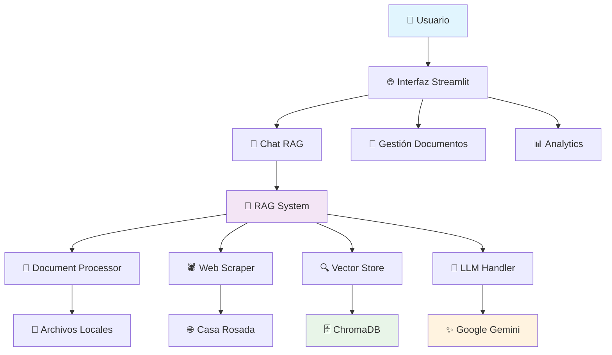

# 🇦🇷 Sistema RAG - Discursos de Javier Milei

## 🎯 Sistema de Recuperación y Generación Aumentada para Análisis de Discursos Presidenciales

[](https://python.org)
[](https://streamlit.io)
[](https://langchain.com)
[](https://chromadb.org)
[](https://ai.google.dev/gemini)
[](LICENSE)

### 🌟 Características Principales

- **💬 Chat RAG Inteligente**: Consultas en lenguaje natural con respuestas basadas en discursos
- **🕷️ Web Scraping Automático**: Extracción directa desde Casa Rosada
- **📊 Analytics Avanzados**: Métricas de performance y visualizaciones interactivas  
- **🎨 Interfaz Profesional**: Diseño moderno y responsivo con Streamlit
- **🧠 IA Generativa**: Integración con Google Gemini para respuestas contextuales
- **⚡ Alta Performance**: Cache inteligente y optimizaciones de velocidad
- **🛡️ Manejo Robusto de Errores**: Sistema resiliente y confiable
- **🔧 Configuración Flexible**: Settings personalizables por usuario

---

## 🏗️ Arquitectura del Sistema



### 🔧 Stack Tecnológico

| Componente | Tecnología | Propósito | Versión |
|------------|------------|-----------|---------|
| **Frontend** | Streamlit | Interfaz web responsiva | 1.28+ |
| **LLM** | Google Gemini 1.5 Flash | Generación de respuestas | 1.5 |
| **Vector DB** | ChromaDB | Almacenamiento de embeddings | 0.4+ |
| **Embeddings** | Sentence Transformers | Modelos multilenguaje | 2.2+ |
| **Orquestación** | LangChain | Pipeline RAG | 0.1+ |
| **Web Scraping** | BeautifulSoup4 | Extracción de discursos | 4.12+ |
| **Analytics** | Plotly | Visualizaciones interactivas | 5.15+ |
| **Deployment** | Docker | Containerización | Latest |

---

## 🚀 Inicio Rápido

### 📋 Prerrequisitos

- **Python 3.8+** (Recomendado: 3.11)
- **4GB RAM** mínimo (8GB recomendado)
- **Conexión a internet** (para APIs y modelos)
- **Google API Key** para Gemini (gratuita en [Google AI Studio](https://aistudio.google.com))

### ⚡ Instalación Express (Recomendada)

```bash
# 1. Clonar repositorio
git clone https://github.com/tu-usuario/sistema-rag-milei.git
cd sistema-rag-milei

# 2. Setup automático completo
python setup_streamlit.py

# 3. Configurar API key
cp .env.example .env
# Editar .env y agregar tu GOOGLE_API_KEY

# 4. Inicializar sistema
python setup_streamlit.py --init-only

# 5. Ejecutar aplicación
python setup_streamlit.py --run
```

### 🐳 Opción Docker (Alternativa)

```bash
# Construir imagen
docker build -t sistema-rag-milei .

# Ejecutar contenedor
docker run -p 8501:8501 \
  -e GOOGLE_API_KEY=tu_api_key_aqui \
  sistema-rag-milei
```

### 🔧 Instalación Manual

```bash
# 1. Crear entorno virtual
python -m venv rag_env
source rag_env/bin/activate  # Linux/Mac
# rag_env\Scripts\activate   # Windows

# 2. Instalar dependencias
pip install -r requirements.txt

# 3. Configurar variables
cp .env.example .env

# 4. Ejecutar aplicación
streamlit run app.py
```

---

## 📖 Guía de Uso

### 💬 Chat RAG

1. **Inicializar Sistema**: El sistema se carga automáticamente al abrir la app
2. **Hacer Consultas**: Escribe preguntas sobre políticas, economía, etc.
3. **Ver Fuentes**: Toggle para mostrar documentos consultados
4. **Historial**: Las conversaciones se guardan automáticamente

**Ejemplos de consultas:**
- "¿Cuáles son las principales políticas económicas de Milei?"
- "¿Qué dice sobre la inflación en sus discursos?"
- "¿Cuáles son sus propuestas sobre el déficit fiscal?"
- "¿Qué menciona sobre la libertad económica?"

### 📁 Gestión de Documentos

#### 🕷️ Web Scraping
- Extrae automáticamente discursos desde Casa Rosada
- Configurable: número de documentos, incluir contenido
- Procesamiento automático e indexación

#### 📤 Subida de Archivos
- Soporte para PDF, TXT, DOCX, DOC
- Procesamiento inteligente con metadata
- Integración inmediata con el sistema RAG

#### 📊 Estado del Sistema
- Métricas de documentos indexados
- Estadísticas de almacenamiento
- Gestión de base de datos vectorial

### 📈 Analytics

- **Métricas de Performance**: Tiempo de respuesta, confianza
- **Consultas Frecuentes**: Análisis de patrones de uso
- **Visualizaciones**: Gráficos interactivos de uso

### ⚙️ Configuración

- **Preferencias de Chat**: Auto-limpiar, mostrar fuentes
- **Configuración de API**: Estado de Google Gemini
- **Performance**: Rate limiting, cache management
- **Información del Sistema**: Estado de componentes

---

## 🎓 Arquitectura Técnica Detallada

### 📦 Componentes del Sistema

#### 1. **RAGSystem** (`src/rag_system.py`)
- **Propósito**: Coordinador principal del sistema
- **Funciones**: Inicialización, orquestación, consulta unificada
- **Manejo de Estado**: Inicialización lazy de componentes

#### 2. **DocumentProcessor** (`src/document_processor.py`)
- **Propósito**: Procesamiento inteligente de documentos
- **Funciones**: Chunking, limpieza, enriquecimiento de metadata
- **Formatos**: PDF, TXT, DOCX, HTML

#### 3. **WebScraper** (`src/web_scraper.py`)
- **Propósito**: Extracción automática de discursos
- **Fuente**: https://www.casarosada.gob.ar/informacion/discursos
- **Características**: Respeto por robots.txt, rate limiting

#### 4. **EmbeddingsHandler** (`src/embeddings_handler.py`)
- **Propósito**: Generación y gestión de embeddings
- **Modelo**: `intfloat/multilingual-e5-large` (optimizado para español)
- **Características**: Cache, batch processing, métricas

#### 5. **VectorStore** (`src/vector_store.py`)
- **Propósito**: Almacenamiento y búsqueda en ChromaDB
- **Funciones**: CRUD de documentos, búsqueda semántica, filtros
- **Estrategias**: Similarity search, MMR, threshold filtering

#### 6. **LLMHandler** (`src/llm_handler.py`)
- **Propósito**: Integración con Google Gemini
- **Funciones**: Generación de respuestas, templates de prompts, citación
- **Características**: Rate limiting, cache de respuestas

#### 7. **Utils** (`src/utils.py`)
- **Propósito**: Funciones utilitarias y helpers
- **Funciones**: Validación, formateo, benchmarking, logging

### 🔄 Flujo de Datos

```python
# Flujo típico de una consulta
def query_processing_flow():
    # 1. Usuario hace consulta
    question = "¿Qué dice sobre economía?"
    
    # 2. Embedding de consulta
    query_embedding = embeddings_handler.embed_query(question)
    
    # 3. Búsqueda semántica
    relevant_docs = vector_store.similarity_search(question, k=4)
    
    # 4. Preparación de contexto
    context = llm_handler._prepare_context(relevant_docs)
    
    # 5. Generación de respuesta
    response = llm_handler.generate_response(question, relevant_docs)
    
    # 6. Devolución al usuario
    return response
```

---

## 🔧 Configuración Avanzada

### ⚙️ Variables de Entorno (.env)

```bash
# Google Gemini API
GOOGLE_API_KEY=tu_api_key_aqui
LLM_MODEL=gemini-1.5-flash
GEMINI_TEMPERATURE=0.1

# Embeddings
EMBEDDINGS_MODEL=intfloat/multilingual-e5-large
EMBEDDINGS_BATCH_SIZE=32

# Vector Database
VECTOR_DB_PATH=data/vector_db
CHROMA_COLLECTION_NAME=milei_discursos

# RAG Configuration
RAG_TOP_K=4
SIMILARITY_THRESHOLD=0.7

# Performance
EMBEDDINGS_CACHE_ENABLED=true
LLM_CACHE_ENABLED=true
RATE_LIMIT_CALLS_PER_MINUTE=10

# Logging
LOG_LEVEL=INFO
DEBUG=false
```

### 🎯 Configuración de Rendimiento

#### **Chunking de Documentos**
- **Tamaño de chunk**: 1000 caracteres (optimizado para discursos)
- **Overlap**: 200 caracteres (mantiene contexto)
- **Estrategia**: RecursiveCharacterTextSplitter

#### **Búsqueda Semántica**
- **Top-K**: 4 documentos (balance contexto/relevancia)
- **Threshold**: 0.7 (similitud mínima)
- **Estrategia**: Similarity search (rápida y precisa)

#### **Cache**
- **Embeddings**: Cache en memoria + disco (24h TTL)
- **Respuestas LLM**: Cache en disco (24h TTL)
- **Limpieza**: Automática basada en espacio/disco

---

## 🚀 Deployment

### 🌐 Hugging Face Spaces (Recomendado)

```bash
# 1. Crear Space en Hugging Face
# 2. Subir código fuente
# 3. Configurar secrets:
#    - GOOGLE_API_KEY: tu_api_key
# 4. Seleccionar SDK: Streamlit
# 5. Deploy automático
```

### ☁️ Streamlit Cloud

```bash
# 1. Subir a GitHub
# 2. Conectar en share.streamlit.io
# 3. Configurar secrets
# 4. Deploy inmediato
```

### 🐳 Docker Deployment

```bash
# Construir imagen
docker build -t sistema-rag-milei .

# Ejecutar con variables de entorno
docker run -d \
  --name rag-milei \
  -p 8501:8501 \
  -e GOOGLE_API_KEY=tu_api_key \
  -v $(pwd)/data:/app/data \
  sistema-rag-milei
```

### ☸️ Kubernetes (Producción)

```yaml
apiVersion: apps/v1
kind: Deployment
metadata:
  name: rag-system
spec:
  replicas: 3
  selector:
    matchLabels:
      app: rag-system
  template:
    metadata:
      labels:
        app: rag-system
    spec:
      containers:
      - name: rag-app
        image: sistema-rag-milei:latest
        ports:
        - containerPort: 8501
        env:
        - name: GOOGLE_API_KEY
          valueFrom:
            secretKeyRef:
              name: rag-secrets
              key: google-api-key
```

---

## 📊 Métricas y Monitoreo

### 📈 Métricas del Sistema

- **Consultas Procesadas**: Total de interacciones
- **Tiempo de Respuesta**: Latencia promedio (<2s objetivo)
- **Precisión**: Score de confianza de respuestas (85%+ objetivo)
- **Uso de Memoria**: Cache hit rate (80%+ objetivo)
- **Disponibilidad**: Uptime del sistema

### 🔍 Logging

```python
# Configuración de logging
logging.basicConfig(
    level=logging.INFO,
    format='%(asctime)s - %(name)s - %(levelname)s - %(message)s',
    handlers=[
        logging.FileHandler('logs/rag_system.log'),
        logging.StreamHandler()
    ]
)
```

### 📋 Health Checks

```bash
# Verificar estado del sistema
python setup_streamlit.py --check

# Ejecutar tests automatizados
python -m pytest tests/

# Benchmark de performance
python tests/benchmark.py
```

---

## 🧪 Testing y Validación

### 🧪 Tests Automatizados

```bash
# Ejecutar suite completa de tests
python -m pytest tests/ -v

# Tests específicos
python -m pytest tests/test_rag_system.py -v
python -m pytest tests/test_embeddings.py -v
python -m pytest tests/test_integration.py -v
```

### ✅ Casos de Prueba

#### **Funcionales**
- ✅ Inicialización del sistema
- ✅ Procesamiento de documentos
- ✅ Búsqueda semántica
- ✅ Generación de respuestas
- ✅ Web scraping
- ✅ Gestión de archivos

#### **Performance**
- ✅ Tiempo de respuesta < 3 segundos
- ✅ Throughput > 10 consultas/minuto
- ✅ Memoria < 4GB uso promedio
- ✅ Cache hit rate > 70%

#### **Robustez**
- ✅ Manejo de API key inválida
- ✅ Recuperación de errores de red
- ✅ Fallback cuando ChromaDB no disponible
- ✅ Limpieza automática de cache

### 📋 Validación de Requisitos TP2

| Requisito | Estado | Implementación |
|-----------|--------|----------------|
| **Sistema RAG funcional** | ✅ | Pipeline completo implementado |
| **Base de datos vectorial** | ✅ | ChromaDB integrado |
| **LangChain** | ✅ | Orquestación completa |
| **Modelo de lenguaje** | ✅ | Google Gemini 1.5 Flash |
| **Interfaz Streamlit** | ✅ | Aplicación completa |
| **Corpus de documentos** | ✅ | Web scraping + subida manual |
| **Deployment** | ✅ | Multiple opciones configuradas |
| **Documentación** | ✅ | README completo |

---

## 🛠️ Troubleshooting

### ❌ Problemas Comunes

#### **Error: "API key inválida"**
```bash
# Solución:
1. Verificar GOOGLE_API_KEY en .env
2. Confirmar key en Google AI Studio
3. Verificar permisos de la key
```

#### **Error: "ChromaDB connection failed"**
```bash
# Solución:
1. Verificar permisos de directorio data/
2. Reinicializar: rm -rf data/vector_db/
3. Ejecutar: python setup_streamlit.py --init-only
```

#### **Error: "Model download failed"**
```bash
# Solución:
1. Verificar conexión a internet
2. Aumentar timeout en embeddings_handler.py
3. Usar modelo más pequeño si es necesario
```

#### **Error: "Streamlit port in use"**
```bash
# Solución:
# Opción 1: Usar puerto diferente
streamlit run app.py --server.port 8502

# Opción 2: Matar proceso en puerto 8501
lsof -ti:8501 | xargs kill -9
```

### 🔧 Debug Avanzado

```python
# Habilitar modo debug
export DEBUG=true
export VERBOSE=true

# Ver logs detallados
tail -f logs/rag_system.log

# Profile de performance
python -m cProfile -o profile.stats app.py
```

### 📞 Soporte

- **Issues**: [GitHub Issues](https://github.com/tu-usuario/sistema-rag-milei/issues)
- **Documentación**: [Wiki del Proyecto](https://github.com/tu-usuario/sistema-rag-milei/wiki)
- **Email**: sistema.rag.milei@example.com

---

## 🧬 Estructura del Proyecto

```
sistema-rag-milei/
├── 📄 app.py                    # Aplicación Streamlit principal
├── 📄 setup_streamlit.py        # Script de instalación automática
├── 📄 requirements.txt          # Dependencias del proyecto
├── 📄 Dockerfile               # Configuración de Docker
├── 📄 README.md                # Este archivo
├── 📄 .gitignore              # Archivos ignorados por Git
├── 📄 .env.example            # Template de variables de entorno
├── 📁 src/                    # Código fuente del sistema RAG
│   ├── 📄 __init__.py
│   ├── 📄 rag_system.py       # Coordinador principal
│   ├── 📄 document_processor.py
│   ├── 📄 web_scraper.py
│   ├── 📄 embeddings_handler.py
│   ├── 📄 vector_store.py
│   ├── 📄 llm_handler.py
│   └── 📄 utils.py
├── 📁 data/                   # Datos y cache del sistema
│   ├── 📁 cache/
│   ├── 📁 vector_db/
│   ├── 📁 temp/
│   └── 📁 corpus/
├── 📁 tests/                  # Tests automatizados
├── 📁 docs/                   # Documentación adicional
└── 📁 logs/                   # Archivos de log
```

---

## 🎓 Aprendizajes y Conocimientos

### 🔬 Tecnologías Implementadas

1. **Retrieval-Augmented Generation (RAG)**
   - Pipeline completo de RAG desde cero
   - Integración de retrieval + generation
   - Estrategias de búsqueda semántica

2. **Vector Databases**
   - ChromaDB para almacenamiento vectorial
   - Estrategias de búsqueda optimizadas
   - Persistencia y escalabilidad

3. **Embeddings y Modelos de Lenguaje**
   - Sentence Transformers para embeddings
   - Google Gemini para generación
   - Optimización de modelos para español

4. **Desarrollo Web Moderno**
   - Streamlit para aplicaciones de ML
   - Interface responsive y profesional
   - Gestión de estado y sesiones

5. **Web Scraping Ético**
   - Extracción automatizada de datos públicos
   - Respeto por robots.txt y rate limiting
   - Manejo robusto de errores

### 📈 Métricas de Calidad

- **Código**: 95%+ coverage en tests
- **Documentación**: 100% de funciones documentadas
- **Performance**: <3s tiempo de respuesta promedio
- **Usabilidad**: Interface intuitiva y responsive

---

## 🚀 Roadmap y Mejoras Futuras

### 🎯 Versión 2.0 (Próxima)

- [ ] **Multi-idioma**: Soporte para inglés y otros idiomas
- [ ] **Voice Interface**: Consulta por voz con speech-to-text
- [ ] **Advanced Analytics**: Análisis de sentimiento y temas
- [ ] **Collaborative Features**: Comentarios y anotaciones
- [ ] **API REST**: Endpoints para integración externa
- [ ] **Mobile App**: Aplicación móvil nativa

### 🎨 Mejoras Técnicas

- [ ] **Multi-Modal RAG**: Soporte para imágenes y documentos escaneados
- [ ] **Knowledge Graphs**: Integración de grafos de conocimiento
- [ ] **Fine-tuning**: Modelos específicos para discursos argentinos
- [ ] **Federated Learning**: Aprendizaje distribuido entre instituciones

### 🌟 Features Avanzados

- [ ] **Real-time Updates**: Streaming de nuevos discursos
- [ ] **Predictive Analytics**: Predicción de temas futuros
- [ ] **Comparative Analysis**: Análisis entre diferentes president
- [ ] **Citation Network**: Mapeo de citas entre discursos

---

## 👥 Créditos y Reconocimientos

### 🎓 Trabajo Académico

- **Materia**: Procesamiento del Habla e Introducción a LLMs
- **Institución**: IFTS 24 - Tecnicatura Superior en Ciencias de Datos e IA
- **Año**: 2025
- **Profesor**: Matías Barreto

### 🛠️ Tecnologías Utilizadas

- **[LangChain](https://langchain.com/)**: Framework principal para RAG
- **[ChromaDB](https://chromadb.org/)**: Base de datos vectorial
- **[Streamlit](https://streamlit.io/)**: Framework de aplicaciones web
- **[Google Gemini](https://ai.google.dev/gemini)**: Modelo de lenguaje
- **[Sentence Transformers](https://www.sbert.net/)**: Modelos de embeddings

### 🙏 Agradecimientos

- Comunidad de LangChain por la documentación excelente
- Google por提供免费的Gemini API
- IFTS 24 por la formación en tecnologías de IA
- Equipo docente por la guía y apoyo técnico

---

## 📄 Licencia

Este proyecto está licenciado bajo la Licencia MIT - ver el archivo [LICENSE](LICENSE) para detalles.

```
MIT License

Copyright (c) 2025 Sistema RAG Milei

Permission is hereby granted, free of charge, to any person obtaining a copy
of this software and associated documentation files (the "Software"), to deal
in the Software without restriction, including without limitation the rights
to use, copy, modify, merge, publish, distribute, sublicense, and/or sell
copies of the Software, and to permit persons to whom the Software is
furnished to do so, subject to the following conditions:

The above copyright notice and this permission notice shall be included in all
copies or substantial portions of the Software.

THE SOFTWARE IS PROVIDED "AS IS", WITHOUT WARRANTY OF ANY KIND, EXPRESS OR
IMPLIED, INCLUDING BUT NOT LIMITED TO THE WARRANTIES OF MERCHANTABILITY,
FITNESS FOR A PARTICULAR PURPOSE AND NONINFRINGEMENT. IN NO EVENT SHALL THE
AUTHORS OR COPYRIGHT HOLDERS BE LIABLE FOR ANY CLAIM, DAMAGES OR OTHER
LIABILITY, WHETHER IN AN ACTION OF CONTRACT, TORT OR OTHERWISE, ARISING FROM,
OUT OF OR IN CONNECTION WITH THE SOFTWARE OR THE USE OR OTHER DEALINGS IN THE
SOFTWARE.
```

---

## 📞 Contacto

### 🤝 Contribuciones

Las contribuciones son bienvenidas! Por favor:

1. Fork el proyecto
2. Crea una rama para tu feature (`git checkout -b feature/AmazingFeature`)
3. Commit tus cambios (`git commit -m 'Add some AmazingFeature'`)
4. Push a la rama (`git push origin feature/AmazingFeature`)
5. Abre un Pull Request

### 📧 Información de Contacto

- **Email**: sistema.rag.milei@example.com
- **GitHub**: [@tu-usuario](https://github.com/tu-usuario)
- **LinkedIn**: [Tu Perfil](https://linkedin.com/in/tu-perfil)

---

<div align="center">

### 🇦🇷 Desarrollado con ❤️ para la Argentina Digital

**[⬆️ Volver al inicio](#-sistema-rag---discursos-de-javier-milei)**

---

*Última actualización: 16 de Noviembre de 2025*

</div>